# CHAPTER FOUR: SYSTEM ANALYSIS AND DESIGN

## 4.1 Introduction

This chapter presents the system analysis and design of `Creatuno` in direct continuity with Chapter 1 (problem statement, aim/objectives, and scope) and Chapter 3 (methodological framework). It explains how identified ecosystem challenges in Sierra Leone's creative economy were translated into a practical, low-bandwidth-aware platform architecture and design.

The chapter addresses:

- existing-system analysis;
- key problem decomposition;
- proposed system and requirements;
- design models (use case, UML, ERD, DFD, flowcharts);
- architecture and infrastructure view.

---

## 4.2 Analysis of Existing System

Prior to `Creatuno`, creatives in the target context typically relied on fragmented processes:

- social media for portfolio exposure;
- informal messaging for mentorship and client communication;
- disconnected channels for jobs and gigs;
- manual payment coordination;
- always-online tools that degrade under intermittent connectivity.

### 4.2.1 Existing-System Characteristics

1. **Fragmented identity:** professional work and credibility signals were spread across multiple platforms.
2. **Weak mentorship structure:** mentor access and progression pathways were largely informal.
3. **Limited process traceability:** opportunity, application, and transaction lifecycles were hard to track.
4. **Connectivity exclusion:** tools designed for high-bandwidth usage constrained participation.
5. **Low contextual fit:** global platforms did not adequately reflect local workflow and access realities.

---

## 4.3 Problems of the Existing System

### 4.3.1 Mentorship and Professional Development Deficit

- no structured mentor discovery and matching path;
- limited continuity in mentor-mentee engagement;
- weak formal support for practical professional growth.

### 4.3.2 Visibility and Professional Discovery Deficit

- heavy dependence on algorithm-driven social feeds;
- lack of standardized portfolio format for credible professional presentation;
- weak sustained discoverability by employers, collaborators, and investors.

### 4.3.3 Connectivity and Data-Cost Constraint

- intermittent internet and high data costs reduce platform reliability;
- high-bandwidth interfaces become practically inaccessible for many users;
- upload/update operations often fail under unstable network conditions.

### 4.3.4 Employment and Monetization Constraint

- opportunities distributed across scattered channels;
- application workflows lacked clear lifecycle states;
- limited pathways connecting creatives to funding and investment.

### 4.3.5 Platform Fragmentation Constraint

- no unified environment for portfolio, mentorship, opportunities, and funding;
- high friction from multi-platform switching for one professional journey.

---

## 4.4 Proposed System

`Creatuno` is proposed as a mobile-first Progressive Web Application integrating the core professional workflows of creatives in one platform.

### 4.4.1 Proposed Capabilities

- structured digital portfolios and project showcasing;
- mentorship requests, offers, and communication support;
- opportunities listing and application workflows;
- pitch and investor-funding interactions;
- notifications and process-state visibility;
- offline queueing and deferred synchronization.

### 4.4.2 Scope Positioning (Aligned to Chapter 1.8)

- primary user focus: Sierra Leonean creatives, with strong emphasis on ages 18-35;
- operating context: low-bandwidth, mobile-dominant usage conditions;
- evaluation boundary: pilot-oriented implementation and testing.

---

## 4.5 System Requirements

### 4.5.1 Functional Requirements

The system shall:

1. authenticate users and protect restricted operations;
2. support portfolio and project creation, update, and public display;
3. support opportunities listing and applications;
4. support mentorship request/offer and communication flows;
5. support pitch, investor-interest, and payment-linked funding workflows;
6. support notifications for major workflow events;
7. support offline queueing and synchronization.

### 4.5.2 Non-Functional Requirements

- **Availability:** web access with installable PWA behavior.
- **Performance:** data-efficient behavior through caching and optimized delivery.
- **Reliability:** queue-and-sync continuity under unstable connectivity.
- **Security:** authenticated operations and validated callback/webhook processing.
- **Scalability:** domain-modular APIs and migration-driven schema growth.
- **Usability:** clear workflow segmentation for target user tasks.

### 4.5.3 Objective-to-Requirement Traceability Matrix

| Chapter 1 Objective | Requirement Translation | System Subsystem |
|---|---|---|
| Objective 1 | stakeholder needs mapped to domain workflows | feature-domain API + UI modules |
| Objective 2 | low-bandwidth resilient architecture | PWA layer, service worker, queue, sync API |
| Objective 3 | structured portfolio and discoverability | portfolios/public/projects modules |
| Objective 4 | mentorship framework | mentorship/messages/notifications modules |
| Objective 5 | employment and investment linkage | opportunities/applications + pitch/payment modules |

---

## 4.6 Hardware Requirements

### 4.6.1 Development Hardware

- 64-bit CPU;
- minimum 8 GB RAM;
- adequate storage for dependencies/build artifacts;
- reliable internet for package and cloud integration.

### 4.6.2 End-User Hardware

- smartphone or desktop with modern browser support;
- intermittent connectivity tolerated for selected operations via offline queueing;
- optional PWA installation support.

### 4.6.3 Hosting Runtime Requirements

- Node.js-compatible hosting runtime;
- managed database and object storage;
- external identity and payment service availability.

---

## 4.7 Software Requirements

- Next.js, React, TypeScript;
- Supabase SDK and SQL migrations;
- Clerk for authentication;
- Monime payment integration;
- `next-pwa`, service worker, IndexedDB queue utilities;
- lint and build toolchain support.

---

## 4.8 System Design

### 4.8.1 Use Case Diagram

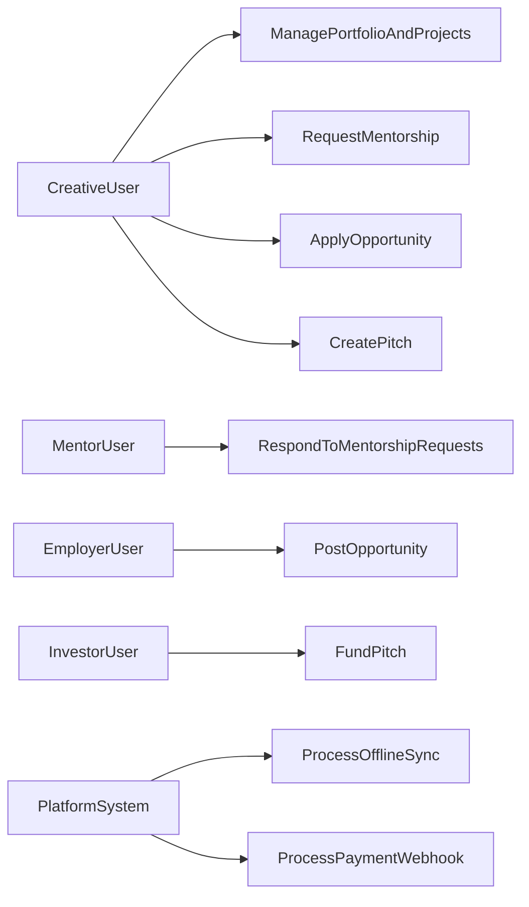

### 4.8.2 UML Domain Model

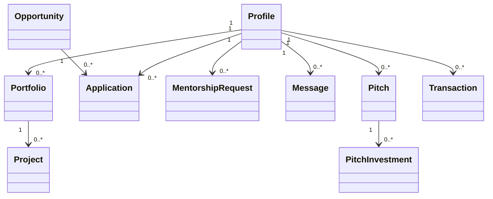

### 4.8.3 ER Diagram

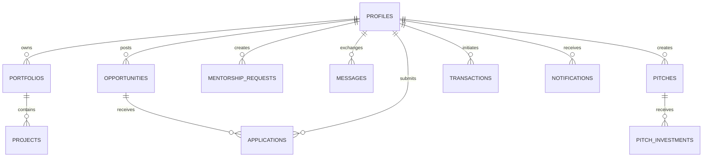

### 4.8.4 Data Flow Diagram

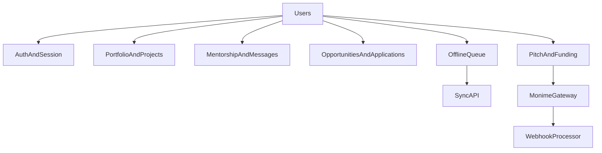

### 4.8.5 System Flowcharts

#### A. Authentication and Access Flow

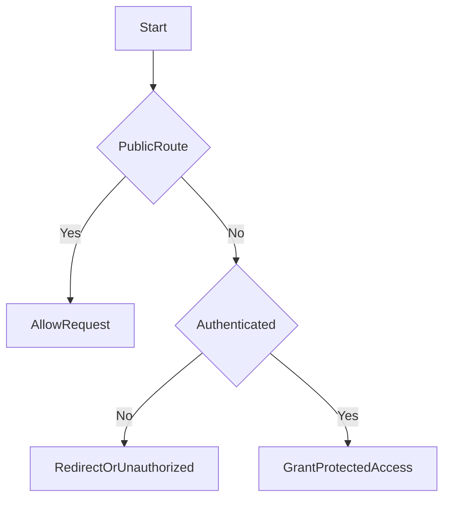

#### B. Offline Synchronization Flow

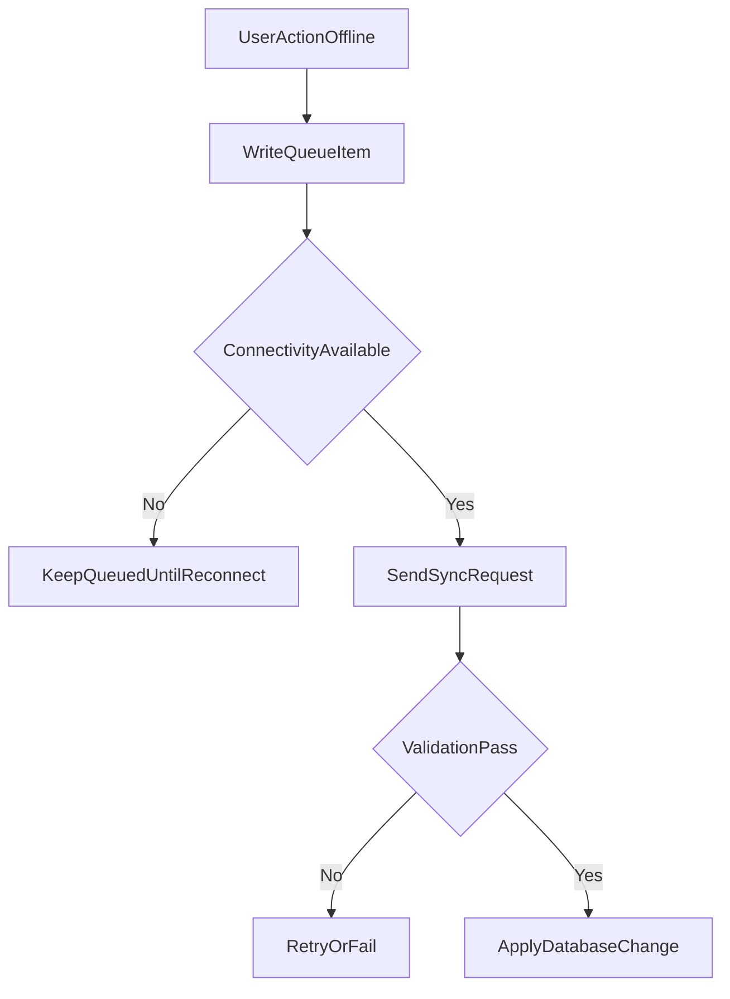

---

## 4.9 System Architecture

### 4.9.1 Architectural Style

`Creatuno` uses a modular monolithic architecture:

- one codebase combining presentation and API layers;
- domain-separated feature modules (`portfolios`, `opportunities`, `mentorship`, `payments`, `sync`);
- shared integration services for auth, data, and payments;
- migration-controlled relational schema evolution.

### 4.9.2 High-Level Architecture Diagram

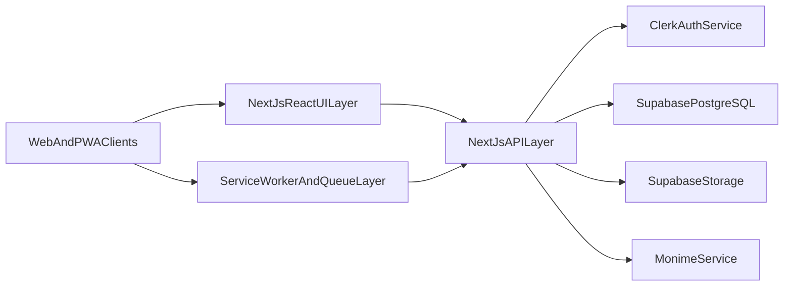

### 4.9.3 Infrastructure and Deployment View

- runtime: Node.js-compatible environment;
- data infrastructure: managed PostgreSQL and media object storage;
- identity infrastructure: external authentication provider;
- transaction infrastructure: third-party payment processing with webhook callbacks;
- client reliability infrastructure: caching and deferred synchronization pipeline.

### 4.9.4 Architecture Strengths and Current Constraints

**Strengths**

- robust low-bandwidth fit through offline-first behavior;
- integrated workflows reduce ecosystem fragmentation;
- modular domain boundaries support incremental scaling.

**Current constraints**

- automated test depth remains expandable;
- advanced observability and production hardening remain next-stage work;
- national-scale impact measurement remains outside pilot scope.

---

## 4.10 Chapter Summary

This chapter translated Chapter 1 problem definitions and Chapter 3 methodological intent into a coherent system analysis and design for `Creatuno`. It established requirements, traceability, design artifacts, architecture rationale, and infrastructure structure suitable for low-bandwidth contexts, forming the foundation for implementation/testing (Chapter 5) and final interpretation (Chapter 6).

# CHAPTER FOUR: SYSTEM ANALYSIS AND DESIGN

Temporary checkpoint.
# CHAPTER FOUR: SYSTEM ANALYSIS AND DESIGN

## 4.1 Introduction

This chapter presents the system analysis and design of `Creatuno` in continuity with Chapter 1 (problem statement, objectives, and scope) and Chapter 3 (research methodology). It explains how the identified constraints in Sierra Leone's creative ecosystem were translated into a practical digital system.

---

## 4.2 Analysis of Existing System

Before `Creatuno`, creative professionals commonly depended on:

- social media for portfolio exposure;
- messaging tools for informal mentorship and client communication;
- scattered channels for job and gig discovery;
- manual payment and weak transaction tracking;
- always-online usage models unsuitable for unstable internet conditions.

### 4.2.1 Core Weaknesses of Existing Practice

1. fragmented professional identity and poor long-term discoverability;
2. unstructured mentorship pathways;
3. weak process visibility for applications and financial interactions;
4. exclusion of users in low-connectivity environments;
5. limited local contextualization of global platforms.

---

## 4.3 Problems of the Existing System

### 4.3.1 Mentorship and Professional Development Deficit

- no formalized mentor discovery and matching flow;
- no structured mentor-mentee continuity process.

### 4.3.2 Portfolio Visibility Deficit

- dependence on algorithmic social feeds for exposure;
- lack of a structured professional portfolio standard for local hiring and collaboration.

### 4.3.3 Connectivity and Data-Cost Constraint

- intermittent internet and high data costs reduce consistent participation;
- high-bandwidth tools are often impractical in target usage contexts.

### 4.3.4 Employment and Monetization Constraint

- opportunities are fragmented across channels;
- funding and investment pathways are poorly structured.

### 4.3.5 System Fragmentation Constraint

- no single platform unifying portfolio, mentorship, opportunities, and funding workflow.

---

## 4.4 Proposed System

`Creatuno` is proposed as a mobile-first Progressive Web Application that integrates core creative-economy workflows in one platform.

### 4.4.1 Proposed System Capabilities

- structured portfolios and project presentation;
- mentorship request, offer, and messaging flows;
- opportunities listing and application workflows;
- pitch and investment interaction workflows;
- notifications and process-state visibility;
- offline queueing and synchronization for selected actions.

---

## 4.5 System Requirements

### 4.5.1 Functional Requirements

The system shall:

1. authenticate users and protect restricted operations;
2. support portfolio and project management;
3. support opportunity posting and applications;
4. support mentorship interaction and communication;
5. support pitch, funding, and transaction flows;
6. support notifications and activity updates;
7. support offline-first queue-and-sync behavior.

### 4.5.2 Non-Functional Requirements

- **Availability:** web and installable PWA access.
- **Performance:** data-efficient behavior using cache strategies.
- **Reliability:** deferred synchronization under unstable connectivity.
- **Security:** authenticated operations and verified payment callbacks.
- **Scalability:** domain-modular APIs and migration-based schema growth.
- **Usability:** clear workflow segmentation for target users.

### 4.5.3 Objective-to-Requirement Traceability

| Chapter 1 Objective | Requirement Translation | Subsystem |
|---|---|---|
| Objective 1 | user/stakeholder needs to workflow modules | domain APIs and UI domains |
| Objective 2 | low-bandwidth architecture behavior | PWA, service worker, IndexedDB queue, sync API |
| Objective 3 | portfolio creation and public discoverability | portfolio/public/project modules |
| Objective 4 | structured mentorship interactions | mentorship/messages/notifications modules |
| Objective 5 | work and investment pathways | opportunities/applications and pitch/payment modules |

---

## 4.6 Hardware Requirements

### 4.6.1 Development Environment

- 64-bit processor;
- minimum 8 GB RAM;
- adequate storage for dependencies and build artifacts;
- internet access for package/cloud integration.

### 4.6.2 End-User Environment

- smartphone or desktop with modern browser;
- intermittent connectivity tolerated for selected operations through offline queueing;
- optional PWA installation.

### 4.6.3 Hosting Environment

- Node.js-compatible runtime;
- managed PostgreSQL and storage services;
- identity and payment service availability.

---

## 4.7 Software Requirements

- Next.js, React, TypeScript;
- Supabase (database/storage) and SQL migrations;
- Clerk authentication;
- Monime payment integration;
- PWA stack (`next-pwa`, service worker, IndexedDB);
- lint/build toolchain.

---

## 4.8 System Design

### 4.8.1 Use Case Diagram

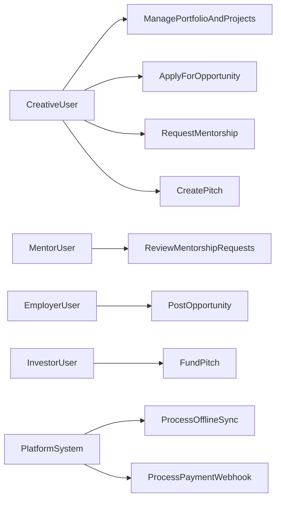

### 4.8.2 UML Domain Model

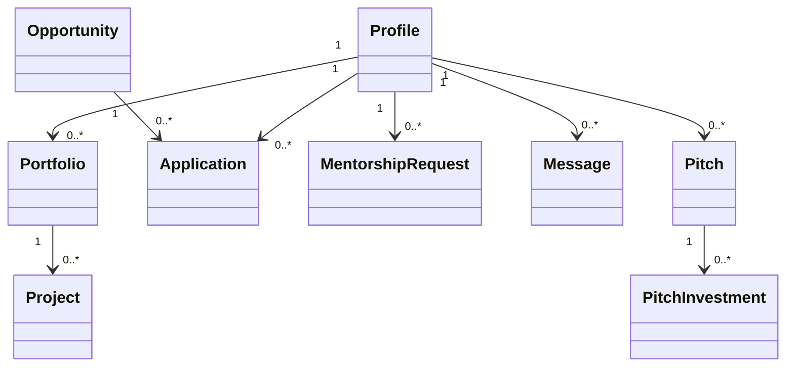

### 4.8.3 ER Diagram

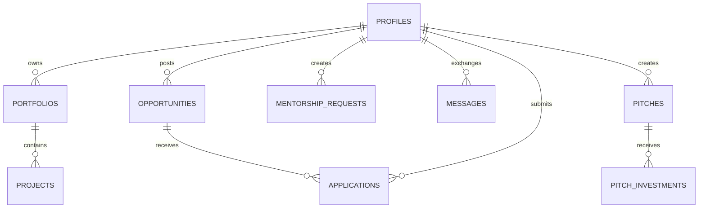

### 4.8.4 Data Flow Diagram

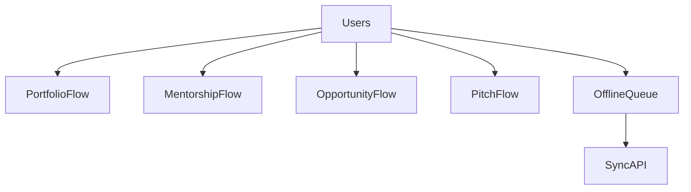

### 4.8.5 System Flowcharts

#### A. Authentication and Access Flow

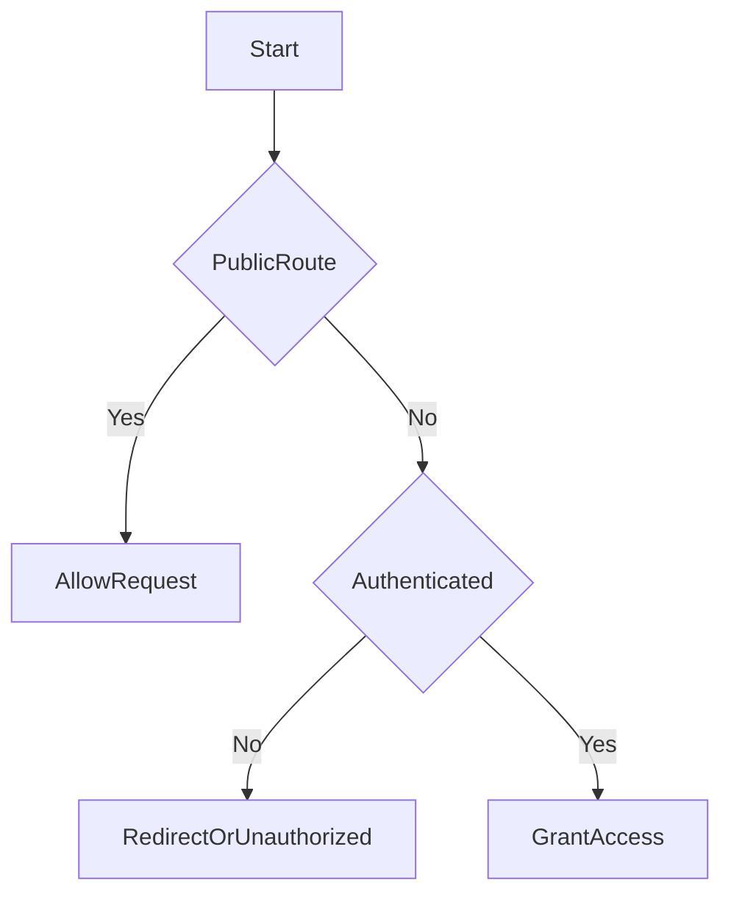

#### B. Offline Synchronization Flow

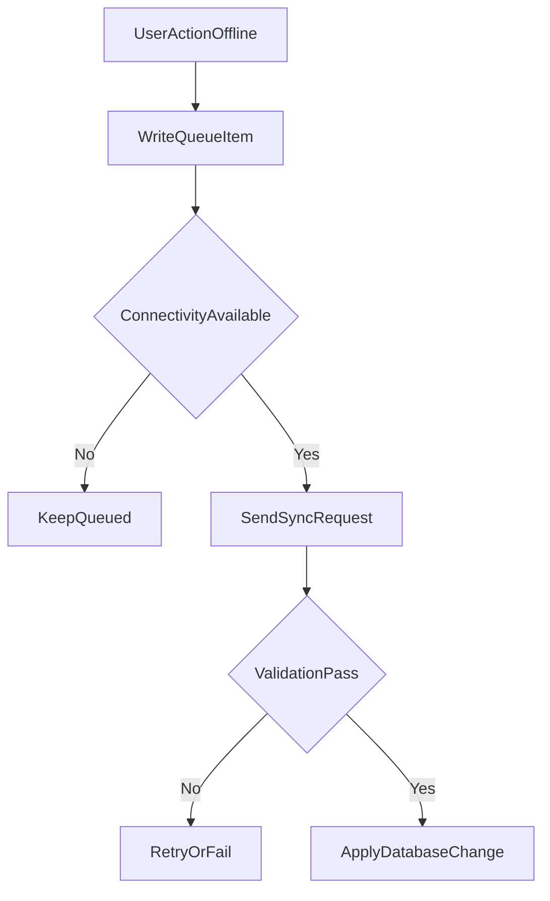

---

## 4.9 System Architecture

### 4.9.1 Architectural Style

`Creatuno` uses a modular monolithic architecture:

- one codebase for presentation and API layers;
- domain-separated modules (`portfolios`, `opportunities`, `mentorship`, `payments`, `sync`);
- shared service layer for integrations;
- migration-based data schema evolution.

### 4.9.2 High-Level Architecture Diagram

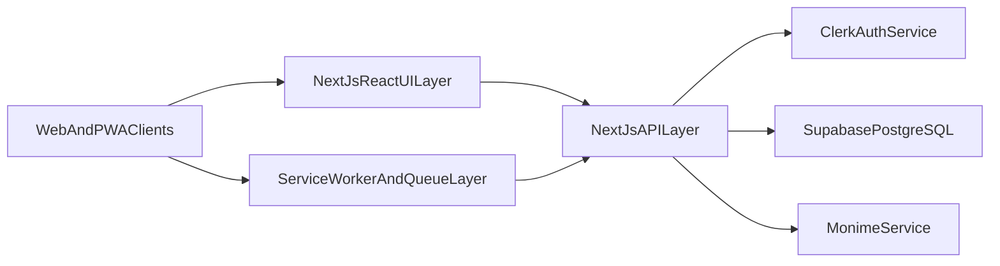

### 4.9.3 Architecture Strengths and Constraints

**Strengths**

- low-bandwidth-aware system behavior;
- integrated professional workflow support;
- modular structure for feature growth.

**Constraints**

- deeper automated test coverage is still needed;
- stronger observability and production hardening remain future work.

---

## 4.10 Chapter Summary

This chapter translated Chapter 1 problem definitions and Chapter 3 methodological intent into a concrete system design for `Creatuno`. It documented requirements, core design artifacts, and architecture choices aligned with low-bandwidth realities, preparing the foundation for implementation and testing in Chapter 5.

# CHAPTER FOUR: SYSTEM ANALYSIS AND DESIGN

## 4.1 Introduction

This chapter presents the analysis and design of `Creatuno` in direct continuity with Chapter 1 (problem statement, objectives, scope) and Chapter 3 (methodology). It explains how the identified creative-economy constraints in Sierra Leone are translated into a practical, low-bandwidth-aware system design.

The chapter focuses on:

- existing ecosystem analysis;
- problems and system requirements;
- design artifacts (use case, UML, ERD, DFD, flowcharts);
- system architecture and subsystem boundaries.

---

## 4.2 Alignment with Chapters 1-3

| Prior Chapter Anchor | Design Need | Chapter 4 Design Response | Linked Chapter 5/6 Interpretation |
|---|---|---|---|
| Chapter 1.3 visibility problem | structured professional identity and discoverability | portfolio/public profile and discovery model | implementation and findings linked to visibility outcomes |
| Chapter 1.3 mentorship problem | formalized mentorship lifecycle | mentorship request/offer/message subsystem design | mentorship module evidence and conclusion mapping |
| Chapter 1.3 connectivity constraint | offline-first system behavior | PWA caching and queue-and-sync architecture | offline testing evidence and technical suitability finding |
| Chapter 1.3 monetization/employment gap | integrated market/funding process | opportunities/applications and pitch/payment flow design | objective attainment and recommendation analysis |
| Chapter 1.4 Objective 2 | low-bandwidth architecture fit | modular monolith with dedicated offline subsystem | validated as context-appropriate in Chapter 6 |
| Chapter 3 DSR/MMRD | build-to-evaluate continuity | requirement traceability and model-driven design | objective-result and RQ-result interpretation |

---

## 4.3 Analysis of Existing System

Before `Creatuno`, users typically depended on disconnected channels:

- social media for portfolio exposure;
- messaging apps for mentorship/client communication;
- scattered channels for jobs and project discovery;
- informal payment coordination with weak traceability;
- always-online workflows that degrade under unstable connectivity.

### 4.3.1 Characteristics of the Existing Ecosystem

1. fragmented professional identity and weak long-term discoverability;
2. ad hoc mentorship with limited structure and progression tracking;
3. weak process transparency for applications and transactions;
4. practical exclusion of low-connectivity users;
5. limited localization for Sierra Leonean workflow realities.

---

## 4.4 Problems of the Existing System

### 4.4.1 Mentorship and Professional Development Deficit

- no formalized mentor discovery and matching route;
- no structured lifecycle for mentorship engagement and continuity.

### 4.4.2 Portfolio Visibility Deficit

- dependence on algorithmic feeds;
- lack of structured local professional portfolio standards.

### 4.4.3 Connectivity and Data-Cost Constraint

- intermittent internet and high data costs reduce reliable platform participation;
- high-bandwidth services become functionally inaccessible for many users.

### 4.4.4 Employment and Monetization Constraint

- opportunity access and applications are fragmented;
- funding and investment pathways are weakly structured.

### 4.4.5 Digital Fragmentation Constraint

- no single workflow joining portfolio, mentorship, opportunities, and funding.

---

## 4.5 Proposed System

`Creatuno` is proposed as a mobile-first Progressive Web Application that unifies creative-economy workflows in one low-friction platform.

### 4.5.1 Design Objectives

- improve discoverability through structured portfolio architecture;
- provide mentorship request/offer/communication pathways;
- connect creatives to opportunities and funding channels;
- support low-bandwidth use through offline-first behavior;
- improve accountability via persistent records and workflow states.

### 4.5.2 Scope Alignment

Aligned to Chapter 1.8:

- primary focus on Sierra Leonean creatives, especially ages 18-35;
- low-bandwidth and mobile-first operating assumptions;
- pilot-oriented implementation and evaluation boundary.

---

## 4.6 System Requirements

### 4.6.1 Functional Requirements

The system shall:

1. authenticate users and protect restricted operations;
2. support portfolio/project creation, update, and public display;
3. support opportunities listing and applications;
4. support mentorship requests, offers, and messaging;
5. support pitch, investor-interest, and payment-linked funding workflows;
6. support notifications for major user and workflow events;
7. support offline queueing and synchronization of selected actions.

### 4.6.2 Non-Functional Requirements

- **Availability:** accessible via web and installable PWA behavior.
- **Performance:** data-efficient behavior with caching and optimized requests.
- **Reliability:** queue-and-sync behavior under intermittent networks.
- **Security:** authenticated operations and validated payment callback flow.
- **Scalability:** modular API domains with migration-driven schema evolution.
- **Usability:** clear workflow segmentation for target user tasks.

### 4.6.3 Requirements Traceability Matrix

| Study Objective (Chapter 1.4) | Requirement Translation | Subsystem/Module | Expected Outcome |
|---|---|---|---|
| Objective 1 | convert ecosystem needs to platform workflows | domain APIs and UI modules | contextual relevance and practical utility |
| Objective 2 | low-bandwidth behavior and resilience | PWA layer, service worker, sync API, IndexedDB queue | continuity under unstable internet |
| Objective 3 | portfolio creation and discoverability | portfolio/public/project modules | stronger professional visibility |
| Objective 4 | mentorship interaction structure | mentorship/messages/notifications modules | more consistent mentorship access |
| Objective 5 | opportunity and funding linkage | opportunities/applications and pitch/payment modules | improved pathway to work and funding |

---

## 4.7 Hardware Requirements

### 4.7.1 Development Environment

- 64-bit processor;
- 8 GB RAM minimum;
- adequate storage for dependencies/build artifacts;
- internet access for package and cloud integration.

### 4.7.2 End-User Environment

- smartphone or desktop with modern browser;
- connectivity recommended, with offline buffering support for selected operations;
- optional PWA installation for repeated access.

### 4.7.3 Runtime/Hosting Environment

- Node.js-capable runtime;
- managed PostgreSQL and object storage services;
- availability of external identity and payment services.

---

## 4.8 Software Requirements

- Next.js, React, TypeScript;
- Supabase SDK plus SQL migrations;
- Clerk authentication services;
- Monime payment integration;
- PWA stack (`next-pwa`, service worker, IndexedDB utilities);
- linting/build toolchain for maintainability.

---

## 4.9 System Design

The system follows a modular monolithic design: one codebase with domain-separated modules and shared integration services.

### 4.9.1 Use Case Diagram

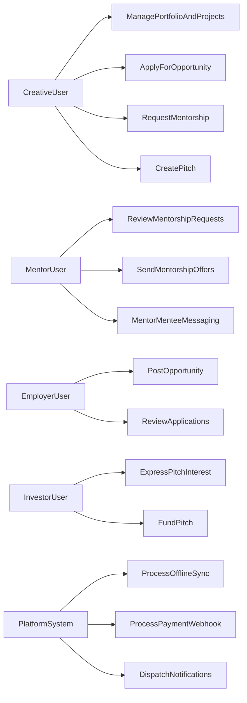

### 4.9.2 UML Domain Model

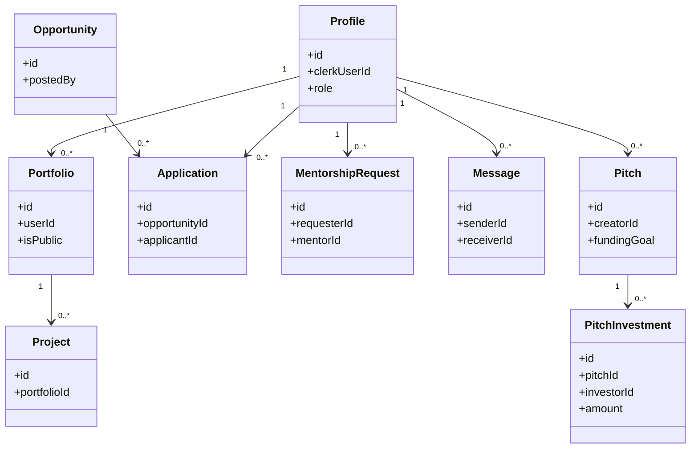

### 4.9.3 ER Diagram


### 4.9.4 Data Flow Diagram

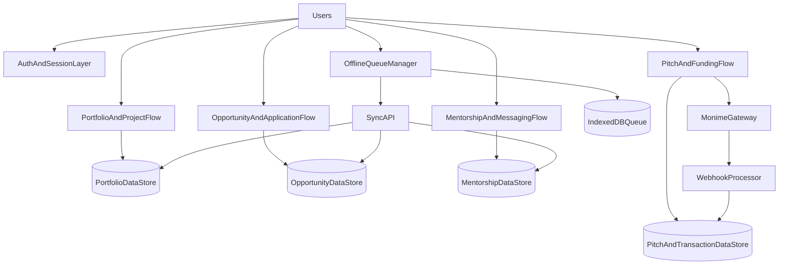

### 4.9.5 System Flowcharts

#### A. Authentication and Access Flow

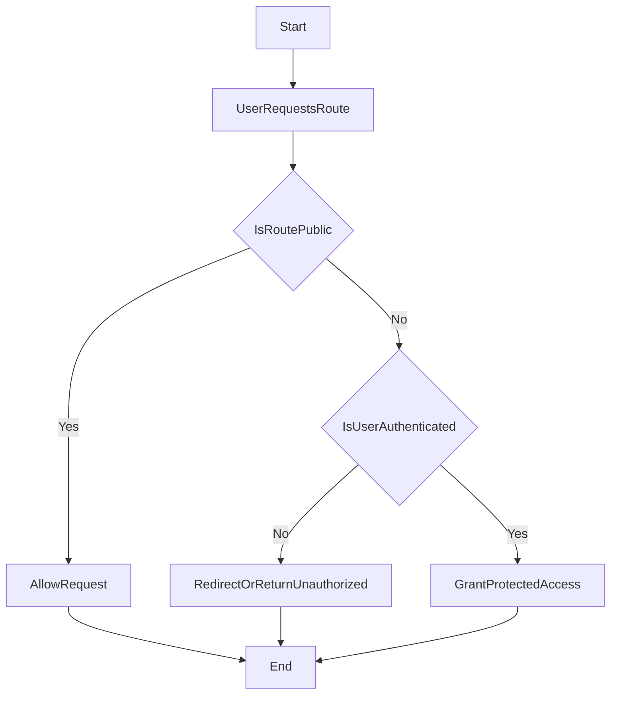

#### B. Offline Synchronization Flow

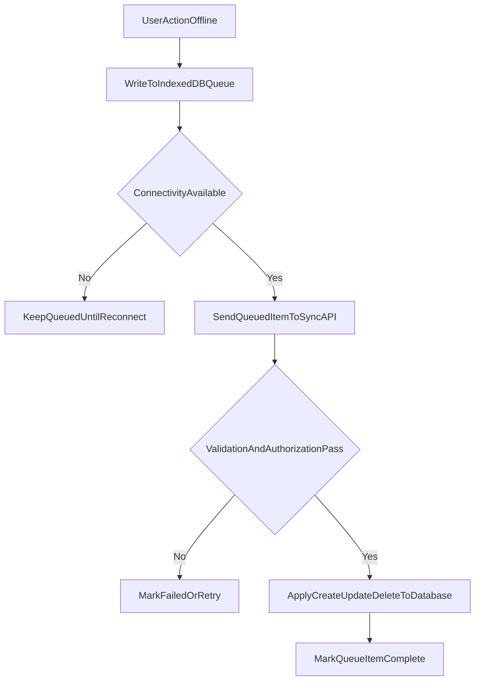

---

## 4.10 System Architecture

### 4.10.1 Architectural Style

`Creatuno` uses a modular monolithic architecture:

- one codebase for UI and backend route handlers;
- domain-separated API modules (`portfolios`, `opportunities`, `mentorship`, `payments`, `sync`);
- shared integration layer for auth, data access, and payment adapters;
- migration-driven schema control.

### 4.10.2 High-Level Architecture Diagram

```mermaid
flowchart LR
    clientLayer[WebAndPWAClients] --> uiLayer[NextJsReactPresentationLayer]
    uiLayer --> apiLayer[NextJsAPIRouteLayer]
    apiLayer --> authService[ClerkAuthService]
    apiLayer --> dbService[SupabasePostgreSQL]
    apiLayer --> storageService[SupabaseStorage]
    apiLayer --> paymentService[MonimeService]
    clientLayer --> offlineLayer[ServiceWorkerAndIndexedDBLayer]
    offlineLayer --> apiLayer
```

### 4.10.3 Strengths and Current Constraints

**Strengths**

- designed for low-bandwidth resilience;
- integrated workflows reduce digital fragmentation;
- modular domains support incremental growth.

**Constraints**

- automated test depth is still evolving;
- stronger observability and production hardening are required for scale;
- nationwide impact measurement remains outside current pilot scope.

---

## 4.11 Chapter Summary

This chapter transformed the Chapter 1 problem definition and Chapter 3 methodological commitments into a coherent system design for `Creatuno`. It provided requirement traceability, design models, and architecture rationale aligned to Sierra Leone's low-bandwidth context, creating the foundation for implementation and evaluation in Chapter 5 and final interpretation in Chapter 6.

# CHAPTER FOUR: SYSTEM ANALYSIS AND DESIGN

## 4.1 Introduction

This chapter presents the analysis and design of `Creatuno` in direct continuity with Chapter 1 (problem context, aim, objectives, and scope) and Chapter 3 (design science and mixed-method methodology). The chapter explains how identified ecosystem problems in Sierra Leone's creative economy are translated into a concrete digital solution, including requirements, design artifacts, and architecture.

The analysis is anchored on the Chapter 1.3 problem clusters:

- mentorship and professional development deficits;
- low market visibility for creatives;
- bandwidth and connectivity constraints;
- weak employment and monetization pathways;
- fragmented and context-misaligned digital tools.

---

## 4.2 Analysis Traceability from Chapter 1-3

| Chapter 1/3 Anchor | Design Implication | Chapter 4 Response | Linked Chapter 5/6 Response |
|---|---|---|---|
| Problem: visibility gap | Need structured professional identity and discovery | Portfolio/public profile and search-oriented model | Functional implementation and findings on visibility improvement |
| Problem: mentorship gap | Need structured mentorship lifecycle | Mentorship request, offer, messaging, and feedback design | Mentorship module implementation and evaluation evidence |
| Problem: low bandwidth | Need offline-first system behavior | PWA, service worker caching, queue-and-sync architecture | Offline synchronization tests and interpretation |
| Problem: weak jobs/monetization | Need opportunity and funding workflows | Opportunities/applications and pitch/payment process design | Implementation evidence and recommendations |
| Objective 2: low-bandwidth architecture | Explicit architectural fit required | Modular monolith with offline subsystem and sync API | Technical suitability conclusion in Chapter 6 |
| Chapter 3 DSR/MMRD | Build-evaluate continuity required | Requirements traceability and model-driven design | Objective/result mapping and structured findings |

---

## 4.3 Analysis of Existing System

Before `Creatuno`, many creatives used disconnected channels:

- social media for showcasing work;
- informal messaging for mentorship and client communication;
- scattered channels for jobs and gigs;
- manual payment coordination and weak transaction visibility;
- always-online workflows unsuitable for unstable internet contexts.

### 4.3.1 Core Characteristics of the Existing Ecosystem

1. fragmented professional identity and weak discoverability;
2. informal mentorship with limited structure and continuity;
3. weak process traceability for applications and transactions;
4. practical exclusion of users in low-connectivity contexts;
5. limited localization for Sierra Leonean workflow realities.

---

## 4.4 Problems of the Existing System

### 4.4.1 Mentorship and Professional Development Gap

- no formalized mentor discovery and matching pathway;
- no structured continuity for mentorship interaction and follow-up.

### 4.4.2 Visibility and Professional Exposure Gap

- dependence on algorithmic social feeds for visibility;
- absence of a structured professional portfolio standard for local market use.

### 4.4.3 Connectivity and Data-Cost Gap

- intermittent internet and high data costs undermine sustained platform use;
- high-bandwidth platforms become functionally inaccessible for many users.

### 4.4.4 Employment and Monetization Gap

- opportunity access is fragmented and poorly tracked;
- limited formal pathways linking creatives to investors or funding.

### 4.4.5 Fragmented Tooling Gap

- no integrated platform combining portfolio, mentorship, opportunities, and funding in one journey.

---

## 4.5 Proposed System

`Creatuno` is proposed as a context-appropriate, mobile-first Progressive Web Application integrating key creative-economy workflows into one platform.

### 4.5.1 Core Design Objectives

- strengthen creative visibility through structured digital portfolios;
- formalize mentorship interactions and communication continuity;
- connect users to opportunities and funding pathways;
- support low-bandwidth use through offline-first behavior;
- improve accountability via persistent digital records.

### 4.5.2 Scope-Constrained Positioning

Aligned with Chapter 1.8:

- primary focus on Sierra Leonean creatives (especially ages 18-35);
- mobile-dominant and low-bandwidth usage assumptions;
- pilot-oriented implementation and evaluation scope.

---

## 4.6 System Requirements

### 4.6.1 Functional Requirements

The system shall:

1. authenticate users and enforce protected operations;
2. support portfolio and project creation, update, and public display;
3. provide opportunities listing and application workflows;
4. support mentorship request/offer interaction and messaging;
5. support pitch, investor-interest, and payment-linked funding flows;
6. generate notifications for key workflow events;
7. support offline queueing and deferred synchronization.

### 4.6.2 Non-Functional Requirements

- **Availability:** web and installable PWA access.
- **Performance:** low-data-friendly behavior via caching and optimized delivery.
- **Reliability:** queue-and-sync handling under intermittent connectivity.
- **Security:** authenticated access control and webhook validation.
- **Scalability:** modular API domains and migration-driven schema growth.
- **Usability:** clear, workflow-based navigation for target user tasks.

### 4.6.3 Requirements Traceability Matrix

| Study Objective (Chapter 1.4) | Requirement Translation | Module/Subsystem | Expected Outcome |
|---|---|---|---|
| Objective 1: requirements analysis | user and stakeholder needs mapped to workflows | domain APIs and UI modules | strong context-fit and practical relevance |
| Objective 2: low-bandwidth PWA architecture | offline queueing, cache behavior, deferred sync | PWA config, service worker, sync API, IndexedDB queue | continuity under unstable connectivity |
| Objective 3: portfolio management | portfolio/project CRUD and public visibility | portfolio/public and project modules | improved professional discoverability |
| Objective 4: mentorship framework | request/offer/message interaction design | mentorship, messages, notifications | more structured mentorship access |
| Objective 5: employment and investment linkage | opportunities, applications, pitch/payment flow | opportunities/applications and payments modules | improved pathway to work and funding |

---

## 4.7 Hardware Requirements

### 4.7.1 Development Hardware

- 64-bit CPU;
- 8 GB RAM minimum (16 GB recommended);
- adequate storage for dependencies and build artifacts;
- internet for package and cloud-service integration.

### 4.7.2 User Hardware

- smartphone or desktop device with modern browser;
- intermittent connectivity supported, though stable internet improves experience;
- optional PWA installation for easier recurring use.

### 4.7.3 Hosting Hardware/Runtime

- Node.js-capable runtime;
- managed database and storage service availability;
- reliable access to identity and payment service endpoints.

---

## 4.8 Software Requirements

- Next.js, React, and TypeScript;
- Supabase SDK and SQL migration framework;
- Clerk authentication integration;
- Monime payment integration;
- `next-pwa`, service worker, and IndexedDB tooling;
- ESLint and build toolchain for code quality.

---

## 4.9 System Design

The system uses a modular monolithic design that separates business concerns by domain while keeping deployment and maintenance manageable in one codebase.

### 4.9.1 Use Case Diagram

```mermaid
flowchart LR
    creativeUser[CreativeUser] --> managePortfolio[ManagePortfolioAndProjects]
    creativeUser --> applyOpportunity[ApplyForOpportunity]
    creativeUser --> requestMentorship[RequestMentorship]
    creativeUser --> createPitch[CreatePitch]

    mentorUser[MentorUser] --> reviewRequests[ReviewMentorshipRequests]
    mentorUser --> sendOffers[SendMentorshipOffers]
    mentorUser --> mentorMessaging[MentorMenteeMessaging]

    employerUser[EmployerUser] --> postOpportunity[PostOpportunity]
    employerUser --> reviewApplications[ReviewApplications]

    investorUser[InvestorUser] --> expressInterest[ExpressPitchInterest]
    investorUser --> fundPitch[FundPitch]

    platformSystem[PlatformSystem] --> processSync[ProcessOfflineSync]
    platformSystem --> processWebhook[ProcessPaymentWebhook]
    platformSystem --> notifyUsers[DispatchNotifications]
```

### 4.9.2 UML Domain Model

```mermaid
classDiagram
    class Profile {
      +id
      +clerkUserId
      +role
      +location
    }
    class Portfolio {
      +id
      +userId
      +title
      +isPublic
    }
    class Project {
      +id
      +portfolioId
      +title
      +mediaUrl
    }
    class Opportunity {
      +id
      +postedBy
      +type
      +status
    }
    class Application {
      +id
      +opportunityId
      +applicantId
      +status
    }
    class MentorshipRequest {
      +id
      +requesterId
      +mentorId
      +status
    }
    class Message {
      +id
      +senderId
      +receiverId
      +content
    }
    class Pitch {
      +id
      +creatorId
      +fundingGoal
      +status
    }
    class PitchInvestment {
      +id
      +pitchId
      +investorId
      +amount
      +status
    }
    Profile "1" --> "0..*" Portfolio
    Portfolio "1" --> "0..*" Project
    Opportunity "1" --> "0..*" Application
    Profile "1" --> "0..*" Application
    Profile "1" --> "0..*" MentorshipRequest
    Profile "1" --> "0..*" Message
    Profile "1" --> "0..*" Pitch
    Pitch "1" --> "0..*" PitchInvestment
```

### 4.9.3 ER Diagram

```mermaid
erDiagram
    PROFILES ||--o{ PORTFOLIOS : owns
    PORTFOLIOS ||--o{ PROJECTS : contains
    PROFILES ||--o{ OPPORTUNITIES : posts
    OPPORTUNITIES ||--o{ APPLICATIONS : receives
    PROFILES ||--o{ APPLICATIONS : submits
    PROFILES ||--o{ MENTORSHIP_REQUESTS : creates
    PROFILES ||--o{ MESSAGES : exchanges
    PROFILES ||--o{ PITCHES : creates
    PITCHES ||--o{ PITCH_INTERESTS : receives
    PITCHES ||--o{ PITCH_INVESTMENTS : receives
    PROFILES ||--o{ TRANSACTIONS : initiates
    PROFILES ||--o{ NOTIFICATIONS : receives
```

### 4.9.4 Data Flow Diagram

```mermaid
flowchart TD
    users[Users] --> authLayer[AuthAndSessionLayer]
    users --> portfolioFlow[PortfolioAndProjectFlow]
    users --> opportunityFlow[OpportunityAndApplicationFlow]
    users --> mentorshipFlow[MentorshipAndMessagingFlow]
    users --> pitchFlow[PitchAndFundingFlow]

    portfolioFlow --> dataStoreOne[(PortfolioDataStore)]
    opportunityFlow --> dataStoreTwo[(OpportunityDataStore)]
    mentorshipFlow --> dataStoreThree[(MentorshipDataStore)]
    pitchFlow --> dataStoreFour[(PitchAndTransactionDataStore)]

    pitchFlow --> paymentGateway[MonimeGateway]
    paymentGateway --> webhookProcessor[WebhookProcessor]
    webhookProcessor --> dataStoreFour

    users --> offlineQueue[OfflineQueueManager]
    offlineQueue --> localQueue[(IndexedDBQueue)]
    offlineQueue --> syncApi[SyncAPI]
    syncApi --> dataStoreOne
    syncApi --> dataStoreTwo
    syncApi --> dataStoreThree
```

### 4.9.5 System Flowcharts

#### A. Authentication and Route Access Flow

```mermaid
flowchart TD
    startNode[Start] --> requestRoute[UserRequestsRoute]
    requestRoute --> routeType{IsRoutePublic}
    routeType -->|Yes| allowRequest[AllowRequest]
    routeType -->|No| authCheck{IsUserAuthenticated}
    authCheck -->|No| denyAccess[RedirectOrReturnUnauthorized]
    authCheck -->|Yes| grantAccess[GrantProtectedAccess]
    allowRequest --> endNode[End]
    denyAccess --> endNode
    grantAccess --> endNode
```

#### B. Offline Synchronization Flow

```mermaid
flowchart TD
    offlineAction[UserActionOffline] --> queueWrite[WriteToIndexedDBQueue]
    queueWrite --> connectivityCheck{ConnectivityAvailable}
    connectivityCheck -->|No| keepQueued[KeepQueuedUntilReconnect]
    connectivityCheck -->|Yes| sendSync[SendQueuedItemToSyncAPI]
    sendSync --> validationCheck{ValidationAndAuthorizationPass}
    validationCheck -->|No| markRetry[MarkFailedOrRetry]
    validationCheck -->|Yes| applyChange[ApplyCreateUpdateDeleteToDatabase]
    applyChange --> markComplete[MarkQueueItemComplete]
```

---

## 4.10 System Architecture

### 4.10.1 Architectural Style

The system adopts a modular monolithic style:

- one codebase contains UI and API route handlers;
- modules are separated by domains (`portfolios`, `opportunities`, `mentorship`, `payments`, `sync`);
- shared integration logic is centralized in library services;
- schema evolves through ordered SQL migrations.

### 4.10.2 High-Level Architecture Diagram

```mermaid
flowchart LR
    clientLayer[WebAndPWAClients] --> uiLayer[NextJsReactPresentationLayer]
    uiLayer --> apiLayer[NextJsAPIRouteLayer]
    apiLayer --> authService[ClerkAuthService]
    apiLayer --> dbService[SupabasePostgreSQL]
    apiLayer --> storageService[SupabaseStorage]
    apiLayer --> paymentService[MonimeService]
    clientLayer --> offlineLayer[ServiceWorkerAndIndexedDBLayer]
    offlineLayer --> apiLayer
```

### 4.10.3 Architectural Strengths and Constraints

**Strengths**

- strong fit for low-bandwidth contexts through offline-first behavior;
- integrated workflow reduces platform fragmentation for target users;
- modular domain structure supports incremental extension.

**Constraints**

- automated testing and observability remain at baseline maturity;
- additional production hardening is required for long-term scale;
- nationwide impact measurement remains outside current pilot scope.

---

## 4.11 Chapter Summary

This chapter transformed the Chapter 1 problem definition and Chapter 3 methodology into a coherent system design for `Creatuno`. It established requirement traceability, defined functional and non-functional requirements, presented UML/ER/flow design artifacts, and justified a low-bandwidth-aware architecture suitable for Sierra Leone's context. These outputs directly support implementation and evaluation reporting in Chapter 5 and final interpretation in Chapter 6.

# CHAPTER FOUR: SYSTEM ANALYSIS AND DESIGN

## 4.1 Introduction

This chapter presents the analysis and design of `Creatuno` in direct continuity with Chapter 1 (problem context, aim, objectives, and scope) and Chapter 3 (design science and mixed-method methodology). The chapter explains the transition from identified ecosystem problems in Sierra Leone's creative economy to the proposed digital solution, system requirements, design artifacts, and architecture.

The analysis is anchored on the five core problem clusters established in Chapter 1.3:

- limited mentorship and professional development pathways;
- low market visibility for creative professionals;
- weak and expensive digital connectivity;
- limited employment, monetization, and investment pathways;
- fragmented and context-misaligned digital tools.

---

## 4.2 Chapter 1-3 to Chapter 4-6 Alignment Map

To ensure dissertation traceability, the table below maps earlier chapters to system design decisions and later implementation/evaluation chapters.

| Chapter 1/3 Anchor | Implication for Design | Chapter 4 Design Response | Linked Chapter 5/6 Outcome |
|---|---|---|---|
| Problem: weak portfolio visibility | Need structured discoverable identity layer | Public portfolio and profile design, search pathways, portfolio/project entities | Portfolio workflows implemented and functionally tested; findings on visibility improvement |
| Problem: mentorship deficit | Need formalized mentor-mentee workflow | Mentorship request, offer, messaging, and feedback subsystems | Mentorship module implemented and tested with usability interpretation |
| Problem: low bandwidth and high data cost | Need offline-first, mobile-first design | PWA + service worker + cached navigation + background sync queue | Offline queue/sync validated in implementation and test cases |
| Problem: weak jobs and monetization pathways | Need opportunity and funding flow integration | Opportunity posting/applications, pitch-investor-interest flow, transaction records | Employment and investment features implemented; conclusion on partial/achieved objectives |
| Objective 2: bandwidth-optimized PWA architecture | Explicit architecture choice required | Layered modular monolith with offline subsystem and sync API | Technical implementation and observed practical benefits documented |
| Objective 5: employment and investment linkages | End-to-end business process modeling required | Opportunity, pitch, payment, and notification process flows | Implementation evidence and recommendation for next-stage hardening |
| Chapter 3 DSR/MMRD | Requirements-to-build-to-evaluate continuity needed | Requirements traceability matrix and UML/flow modeling | Chapter 5 objective-result matrix and Chapter 6 contribution statement |

---

## 4.3 Analysis of Existing System

Prior to `Creatuno`, target users (mainly Sierra Leonean creatives aged 18-35) relied on disconnected tools and informal processes:

- social media pages for showcasing work;
- messaging apps for client and mentor conversations;
- ad hoc channels for job and gig discovery;
- manual payment coordination and weak transaction traceability;
- always-online workflows that perform poorly in intermittent networks.

### 4.3.1 Characteristics of the Existing Ecosystem

1. **Fragmented professional identity:** work samples, profile credibility, and contact points were distributed across multiple platforms.
2. **Informal career support:** mentorship was not structured, making progression highly dependent on personal networks.
3. **Low process accountability:** application status, mentorship progression, and payments lacked transparent lifecycle tracking.
4. **Connectivity exclusion:** high-bandwidth platforms were practically inaccessible for many users outside strong network zones.
5. **Limited local contextualization:** many global platforms were not optimized for local constraints and practical workflows.

---

## 4.4 Problems of the Existing System

Based on Chapter 1.3 and reinforced by Chapter 2 comparative analysis, the key problems are:

### 4.4.1 Mentorship and Professional Development Gap

- no structured mentor discovery and matching channel;
- weak continuity in mentor-mentee communication and progress follow-up;
- limited pathway for practical business skills transfer.

### 4.4.2 Visibility and Professional Discovery Gap

- creatives depended on algorithm-driven social content visibility;
- no standardized local portfolio format for employers/investors;
- weak long-term discoverability of creative work.

### 4.4.3 Infrastructure and Access Constraints

- low and uneven connectivity and high data costs;
- frequent failure of upload/update workflows under unstable internet;
- low tolerance for large app downloads and frequent updates.

### 4.4.4 Employment and Monetization Constraints

- opportunities scattered across informal channels;
- unstructured application process and weak tracking;
- limited investor/funding linkage mechanisms.

### 4.4.5 Platform Fragmentation Problem

- no single system combining portfolio, mentorship, opportunities, and funding;
- operational friction for users switching tools across one professional journey.

---

## 4.5 Proposed System

`Creatuno` is proposed as a context-appropriate, mobile-first Progressive Web Application that integrates core creative-economy workflows in one environment.

### 4.5.1 System Goals

- increase professional visibility through structured portfolios;
- formalize mentorship through request/offer/communication workflows;
- connect creatives to opportunities and funding interactions;
- support low-bandwidth usage through offline-first behavior;
- improve trust and accountability through persistent digital records.

### 4.5.2 Scope-Constrained Positioning

Aligned with Chapter 1.8:

- primary users: Sierra Leonean creatives, with strong focus on ages 18-35;
- context: low-bandwidth and mobile-dominant usage conditions;
- evaluation orientation: pilot-style implementation and testing, not nationwide impact measurement.

---

## 4.6 System Requirements

## 4.6.1 Functional Requirements

The system shall:

1. authenticate users and protect role-sensitive workflows;
2. allow creatives to create, edit, and publish portfolios and projects;
3. provide opportunities listing and application workflows;
4. support mentorship requests, offers, messaging, and feedback;
5. support pitch creation, investor interest, and payment-linked funding flow;
6. generate user notifications for major workflow events;
7. support offline queueing and deferred synchronization for selected operations.

## 4.6.2 Non-Functional Requirements

- **Availability:** web access with installable PWA behavior.
- **Performance:** optimized for low-data mobile conditions using caching strategies.
- **Reliability:** queue-and-sync behavior to reduce data loss during network interruptions.
- **Security:** authenticated API access, route-level protection, and webhook verification.
- **Scalability:** modular API domains backed by relational schema evolution via migrations.
- **Usability:** clear workflow segmentation for portfolio, mentorship, opportunities, and funding.

## 4.6.3 Requirements Traceability Matrix

| Study Objective (Chapter 1.4) | Functional Requirement | System Module/Subsystem | Expected Design Outcome |
|---|---|---|---|
| Objective 1: requirements-informed solution | User and stakeholder needs translated into workflows | API domains and UI modules per problem cluster | High requirement relevance and usability fitness |
| Objective 2: mobile-first, bandwidth-optimized architecture | Offline queueing, caching, deferred sync | PWA config, service worker, sync endpoint, IndexedDB queue | Continued operation under intermittent connectivity |
| Objective 3: portfolio management system | Portfolio/project CRUD and public discoverability | Portfolio pages, portfolio/public API, project API | Improved professional presentation and discoverability |
| Objective 4: mentorship framework | Request, matching interaction, communication tools | Mentorship APIs, messages, notifications | Structured mentorship access and continuity |
| Objective 5: employment and investment linkage | Opportunity and funding workflows | Opportunities/applications, pitches, payment APIs | Increased pathway to work and funding participation |

---

## 4.7 Hardware Requirements

### 4.7.1 Development Environment

- 64-bit CPU;
- 8 GB RAM minimum (16 GB recommended);
- sufficient local storage for dependencies, build artifacts, and media assets;
- internet connectivity for cloud service integration and package management.

### 4.7.2 End-User Environment

- smartphone or desktop device with modern browser support;
- network connectivity recommended, but core flows can tolerate interruptions via offline queueing;
- optional PWA installation for improved repeat access.

### 4.7.3 Hosting/Infrastructure Environment

- Node.js-capable runtime for Next.js deployment;
- managed PostgreSQL and object storage (Supabase);
- integrated identity and payment services.

---

## 4.8 Software Requirements

- Next.js and React for full-stack web delivery;
- TypeScript for type-safe development;
- Supabase SDK and SQL migrations for data layer implementation;
- Clerk for authentication and session-aware route protection;
- Monime integration for payment-related workflows;
- PWA stack (`next-pwa`, service worker, IndexedDB library) for offline-first behavior;
- ESLint and build tooling for quality and maintainability support.

---

## 4.9 System Design

The system follows a modular monolithic design where presentation, API logic, and integration modules are unified in one repository while maintaining separation by functional domains.

### 4.9.1 Use Case Diagram

```mermaid
flowchart LR
    creativeUser[CreativeUser] --> managePortfolio[ManagePortfolioAndProjects]
    creativeUser --> applyOpportunity[ApplyForOpportunity]
    creativeUser --> requestMentorship[RequestMentorship]
    creativeUser --> createPitch[CreatePitch]

    mentorUser[MentorUser] --> reviewRequests[ReviewMentorshipRequests]
    mentorUser --> sendOffers[SendMentorshipOffers]
    mentorUser --> mentorMessaging[MentorMenteeMessaging]

    employerUser[EmployerUser] --> postOpportunity[PostOpportunity]
    employerUser --> reviewApplications[ReviewApplications]

    investorUser[InvestorUser] --> expressInterest[ExpressPitchInterest]
    investorUser --> fundPitch[FundPitch]

    systemActor[PlatformSystem] --> processSync[ProcessOfflineSync]
    systemActor --> processWebhook[ProcessPaymentWebhook]
    systemActor --> notifyUsers[DispatchNotifications]
```

### 4.9.2 UML Domain Model

```mermaid
classDiagram
    class Profile {
      +id
      +clerkUserId
      +role
      +location
    }
    class Portfolio {
      +id
      +userId
      +title
      +isPublic
    }
    class Project {
      +id
      +portfolioId
      +title
      +mediaUrl
    }
    class Opportunity {
      +id
      +postedBy
      +type
      +status
    }
    class Application {
      +id
      +opportunityId
      +applicantId
      +status
    }
    class MentorshipRequest {
      +id
      +requesterId
      +mentorId
      +status
    }
    class Message {
      +id
      +senderId
      +receiverId
      +content
    }
    class Pitch {
      +id
      +creatorId
      +fundingGoal
      +status
    }
    class PitchInvestment {
      +id
      +pitchId
      +investorId
      +amount
      +status
    }
    Profile "1" --> "0..*" Portfolio
    Portfolio "1" --> "0..*" Project
    Opportunity "1" --> "0..*" Application
    Profile "1" --> "0..*" Application
    Profile "1" --> "0..*" MentorshipRequest
    Profile "1" --> "0..*" Message
    Profile "1" --> "0..*" Pitch
    Pitch "1" --> "0..*" PitchInvestment
```

### 4.9.3 ER Diagram

```mermaid
erDiagram
    PROFILES ||--o{ PORTFOLIOS : owns
    PORTFOLIOS ||--o{ PROJECTS : contains
    PROFILES ||--o{ POSTS : creates
    POSTS ||--o{ COMMENTS : has
    POSTS ||--o{ LIKES : has
    PROFILES ||--o{ OPPORTUNITIES : posts
    OPPORTUNITIES ||--o{ APPLICATIONS : receives
    PROFILES ||--o{ APPLICATIONS : submits
    PROFILES ||--o{ MENTORSHIP_REQUESTS : creates
    PROFILES ||--o{ MESSAGES : exchanges
    PROFILES ||--o{ NOTIFICATIONS : receives
    PROFILES ||--o{ PITCHES : creates
    PITCHES ||--o{ PITCH_INTERESTS : receives
    PITCHES ||--o{ PITCH_INVESTMENTS : receives
    PROFILES ||--o{ TRANSACTIONS : initiates
```

### 4.9.4 Data Flow Diagram

```mermaid
flowchart TD
    users[Users] --> authLayer[AuthAndSessionLayer]
    users --> portfolioFlow[PortfolioAndProjectFlow]
    users --> opportunityFlow[OpportunityAndApplicationFlow]
    users --> mentorshipFlow[MentorshipAndMessagingFlow]
    users --> pitchFlow[PitchAndFundingFlow]

    portfolioFlow --> dataStoreOne[(PortfolioDataStore)]
    opportunityFlow --> dataStoreTwo[(OpportunityDataStore)]
    mentorshipFlow --> dataStoreThree[(MentorshipDataStore)]
    pitchFlow --> dataStoreFour[(PitchAndTransactionDataStore)]

    pitchFlow --> paymentGateway[MonimeGateway]
    paymentGateway --> webhookProcess[WebhookProcessor]
    webhookProcess --> dataStoreFour

    users --> offlineQueue[OfflineQueueManager]
    offlineQueue --> localStore[(IndexedDBQueue)]
    offlineQueue --> syncApi[SyncAPI]
    syncApi --> dataStoreOne
    syncApi --> dataStoreTwo
    syncApi --> dataStoreThree
```

### 4.9.5 System Flowcharts

#### A. Authentication and Route Access Flow

```mermaid
flowchart TD
    startNode[Start] --> requestRoute[UserRequestsRoute]
    requestRoute --> routeType{IsRoutePublic}
    routeType -->|Yes| allowPublic[AllowRequest]
    routeType -->|No| authCheck{IsUserAuthenticated}
    authCheck -->|No| denyOrRedirect[RedirectOrReturnUnauthorized]
    authCheck -->|Yes| grantAccess[GrantProtectedAccess]
    allowPublic --> endNode[End]
    denyOrRedirect --> endNode
    grantAccess --> endNode
```

#### B. Offline Sync Flow

```mermaid
flowchart TD
    offlineStart[UserActsOffline] --> queueWrite[WriteOperationToIndexedDBQueue]
    queueWrite --> connectivityCheck{ConnectivityAvailable}
    connectivityCheck -->|No| waitState[KeepQueuedUntilReconnect]
    connectivityCheck -->|Yes| sendSync[SendQueuedItemToSyncAPI]
    sendSync --> serverValidation{ValidationAndAuthorizationPass}
    serverValidation -->|No| markFailed[MarkFailedOrRetry]
    serverValidation -->|Yes| applyDbWrite[ApplyCreateUpdateDeleteToDatabase]
    applyDbWrite --> markDone[MarkQueueItemCompleted]
```

---

## 4.10 System Architecture

### 4.10.1 Architectural Style

The implemented style is a **modular monolith**:

- one application codebase contains UI and backend route handlers;
- modules are separated by business domains (`portfolios`, `opportunities`, `mentorship`, `payments`, `sync`);
- shared integration logic is centralized in library services;
- schema evolution is controlled through ordered SQL migrations.

### 4.10.2 High-Level Architecture Diagram

```mermaid
flowchart LR
    clientLayer[WebAndPWAClients] --> uiLayer[NextJsReactPresentationLayer]
    uiLayer --> apiLayer[NextJsAPIRouteLayer]
    apiLayer --> authService[ClerkAuthService]
    apiLayer --> dbService[SupabasePostgreSQL]
    apiLayer --> storageService[SupabaseStorage]
    apiLayer --> paymentService[MonimeService]
    clientLayer --> offlineLayer[ServiceWorkerAndIndexedDBLayer]
    offlineLayer --> apiLayer
```

### 4.10.3 Subsystem Boundaries

1. **Presentation subsystem:** pages/components for dashboard and public-facing journeys.
2. **Application subsystem:** route handlers for business operations and policy checks.
3. **Data subsystem:** relational entities, foreign-key relationships, and migration-managed schema.
4. **Integration subsystem:** identity, storage, and payment connectors.
5. **Offline subsystem:** cached resources, local queue, and synchronization orchestration.

### 4.10.4 Architecture Strengths and Current Constraints

**Strengths**

- direct fit to low-bandwidth requirement through offline-first path;
- integrated workflow reduces professional fragmentation;
- modular design supports incremental domain extension.

**Constraints**

- advanced observability and automated test coverage remain limited;
- some production hardening tasks remain (policy tightening and operational monitoring);
- nationwide impact assessment remains outside pilot-scale scope.

---

## 4.11 Chapter Summary

This chapter translated Chapter 1 problem statements and Chapter 3 methodological commitments into a concrete system analysis and design for `Creatuno`. It established a clear requirement-to-design traceability path, specified functional and non-functional requirements, presented core diagrams, and documented the architecture chosen to fit Sierra Leone's low-bandwidth and mobile-first context. These design decisions provide the foundation for implementation and testing in Chapter 5 and findings interpretation in Chapter 6.

# CHAPTER FOUR: SYSTEM ANALYSIS AND DESIGN

## 4.1 Introduction

This chapter presents the analysis and design of the developed application, `Creatuno`, a full-stack web platform for creatives, mentors, employers, and investors. The system was designed to address portfolio visibility challenges, fragmented mentorship and opportunity access, and unreliable internet access for users in low-connectivity environments. The chapter covers the existing system, identified problems, proposed solution, requirements, design artifacts, and architecture.

---

## 4.2 Analysis of Existing System

Before the development of `Creatuno`, the target users mostly relied on:

- Disconnected social media pages for showcasing portfolio works.
- Informal messaging platforms for mentorship interactions.
- Separate job boards and opportunity channels for applications.
- Manual payment arrangements and external records for transactions.
- Constant internet connectivity for profile updates and submissions.

### 4.2.1 Characteristics of the Existing Approach

- **No unified platform:** portfolios, opportunities, mentorship, and funding workflows were fragmented.
- **Low trust and weak traceability:** important interactions (applications, mentorship, investment intent, payments) were difficult to track end-to-end.
- **Poor resilience in unstable networks:** users could lose progress when the internet dropped during submission/update operations.
- **Limited structured data:** reporting and analytics were difficult because records were spread across multiple channels.

---

## 4.3 Problems of the Existing System

The major limitations identified in the existing system are:

1. **Portfolio discoverability problem**  
   Creatives lacked structured profiles and public search surfaces dedicated to their work.

2. **Opportunity access gap**  
   Job/gig/investment opportunities were not consolidated, causing high search effort and missed chances.

3. **Mentorship fragmentation**  
   Mentorship requests, acceptance, communication, and feedback had no centralized workflow.

4. **Transaction and accountability issues**  
   Payment and delivery-related activities had weak auditability and limited status visibility.

5. **Network dependency risk**  
   Existing approaches failed in low-bandwidth/offline scenarios, causing data entry loss and user frustration.

---

## 4.4 Proposed System

`Creatuno` is proposed as an integrated digital platform that provides:

- User authentication and access control.
- Creative profile and portfolio management.
- Opportunity publishing and application processing.
- Mentorship request/offer management and messaging.
- Pitch and investment flows with payment gateway integration.
- Notification and activity tracking.
- Offline-first synchronization for unreliable internet conditions.

### 4.4.1 Core Objectives

- Provide one platform for key creative-economy workflows.
- Improve visibility and discoverability of creative talent.
- Improve trust through trackable process states and persistent records.
- Maintain usability during connectivity outages via local caching and sync queues.

---

## 4.5 System Requirements

### 4.5.1 Functional Requirements

The system shall:

- Register and authenticate users.
- Allow creatives to create/edit/publicly share portfolios and projects.
- Allow organizations/users to post opportunities and receive applications.
- Support mentorship requests, offers, feedback, and message exchange.
- Support pitch publication, investor interest, and funding checkout flow.
- Record transactions and generate user notifications.
- Support offline queueing and deferred sync of selected user actions.

### 4.5.2 Non-Functional Requirements

- **Availability:** accessible as a web application with PWA support.
- **Security:** authenticated access for protected operations; webhook verification for payment callbacks.
- **Performance:** responsive UI and cached assets for faster repeated access.
- **Scalability:** modular API endpoints and PostgreSQL-backed persistence.
- **Usability:** mobile-friendly interface and clear workflow segmentation.
- **Reliability:** conflict-aware sync flow and robust server-side validation.

---

## 4.6 Hardware Requirements

### 4.6.1 Development Environment (Minimum)

- CPU: Dual-core 64-bit processor.
- RAM: 8 GB minimum (16 GB recommended).
- Storage: At least 10 GB free space for project dependencies and build artifacts.
- Internet: Required for package installation, authentication, Supabase, and payment service integration.

### 4.6.2 User/Client Device Requirements

- Smartphone or PC with a modern browser.
- Stable internet recommended, but core actions can use offline-first buffering and later sync.
- Optional: installable PWA support for improved accessibility.

### 4.6.3 Server/Cloud Requirements

- Node.js runtime capable of serving Next.js application.
- Managed PostgreSQL and object storage (Supabase).
- Third-party auth and payment service availability.

---

## 4.7 Software Requirements

### 4.7.1 Development Software

- Node.js and npm.
- TypeScript.
- Next.js (App Router architecture).
- React.
- Tailwind CSS.
- ESLint.

### 4.7.2 Platform Services and Libraries

- Clerk (authentication and user identity).
- Supabase (PostgreSQL database + storage).
- Monime (payment workflows and webhook callbacks).
- `next-pwa` + service worker + IndexedDB utilities for offline support.

### 4.7.3 Deployment Software

- Any Node.js-compatible hosting target for Next.js.
- Environment variable management for API keys and service secrets.

---

## 4.8 System Design

The design follows a modular full-stack web architecture where frontend pages and backend API route handlers coexist in one codebase.

### 4.8.1 Use Case Diagram

```mermaid
flowchart LR
    A[Creative User] --> U1[Manage Profile and Portfolio]
    A --> U2[Browse Opportunities]
    A --> U3[Submit Application]
    A --> U4[Request Mentorship]
    A --> U5[Create Pitch]

    B[Mentor] --> U6[Review Mentorship Requests]
    B --> U7[Send Mentorship Offers]
    B --> U8[Message Mentees]

    C[Employer/Organization] --> U9[Post Opportunity]
    C --> U10[Review Applications]
    C --> U11[Track Transactions]

    D[Investor] --> U12[Express Interest in Pitch]
    D --> U13[Fund Pitch]

    E[System Admin/Platform] --> U14[Manage Records and Notifications]
    E --> U15[Process Webhooks and Sync]
```

### 4.8.2 UML Diagrams

#### (a) High-Level Class/Domain Model (Conceptual)

```mermaid
classDiagram
    class Profile {
      +id
      +clerk_user_id
      +role
      +bio
    }
    class Portfolio {
      +id
      +user_id
      +title
      +is_public
    }
    class Project {
      +id
      +portfolio_id
      +title
      +description
    }
    class Opportunity {
      +id
      +posted_by
      +type
      +status
    }
    class Application {
      +id
      +opportunity_id
      +applicant_id
      +status
    }
    class MentorshipRequest {
      +id
      +requester_id
      +mentor_id
      +status
    }
    class Pitch {
      +id
      +creator_id
      +funding_goal
      +status
    }
    class PitchInvestment {
      +id
      +pitch_id
      +investor_id
      +amount
      +status
    }
    class Transaction {
      +id
      +payer_id
      +payee_id
      +amount
      +status
    }

    Profile "1" --> "0..*" Portfolio
    Portfolio "1" --> "0..*" Project
    Opportunity "1" --> "0..*" Application
    Profile "1" --> "0..*" Application
    Profile "1" --> "0..*" MentorshipRequest
    Profile "1" --> "0..*" Pitch
    Pitch "1" --> "0..*" PitchInvestment
    Profile "1" --> "0..*" Transaction
```

#### (b) Sequence Diagram (Offline Sync Example)

```mermaid
sequenceDiagram
    participant U as User
    participant C as Client App (PWA)
    participant IDB as IndexedDB Queue
    participant API as /api/sync
    participant DB as Supabase PostgreSQL

    U->>C: Create/Update item while offline
    C->>IDB: Save operation in local queue
    Note over C,IDB: Operation persists locally
    C->>API: Send queued operation when online
    API->>DB: Validate and apply create/update/delete
    DB-->>API: Success/Conflict/Error
    API-->>C: Sync response
    C->>IDB: Mark queue item completed or retry
```

### 4.8.3 ER Diagram

```mermaid
erDiagram
    PROFILES ||--o{ PORTFOLIOS : owns
    PORTFOLIOS ||--o{ PROJECTS : contains
    PROFILES ||--o{ POSTS : creates
    POSTS ||--o{ COMMENTS : has
    POSTS ||--o{ LIKES : has
    PROFILES ||--o{ OPPORTUNITIES : posts
    OPPORTUNITIES ||--o{ APPLICATIONS : receives
    PROFILES ||--o{ APPLICATIONS : submits
    PROFILES ||--o{ MENTORSHIP_REQUESTS : requests
    PROFILES ||--o{ MENTORSHIPS : participates
    PROFILES ||--o{ NOTIFICATIONS : receives
    PROFILES ||--o{ TRANSACTIONS : initiates
    PROFILES ||--o{ PITCHES : creates
    PITCHES ||--o{ PITCH_INTERESTS : attracts
    PITCHES ||--o{ PITCH_INVESTMENTS : funded_by
```

### 4.8.4 Data Flow Diagram (Level-1)

```mermaid
flowchart TD
    U[Users: Creatives, Mentors, Employers, Investors] --> P1[Authentication and Session]
    U --> P2[Portfolio and Project Management]
    U --> P3[Opportunities and Applications]
    U --> P4[Mentorship and Messaging]
    U --> P5[Pitch and Funding]

    P1 --> D1[(Profiles DB)]
    P2 --> D2[(Portfolios and Projects DB)]
    P3 --> D3[(Opportunities and Applications DB)]
    P4 --> D4[(Mentorship and Messages DB)]
    P5 --> D5[(Pitches and Transactions DB)]

    P5 --> X1[Monime Payment Gateway]
    X1 --> P6[Webhook Processor]
    P6 --> D5

    U --> P7[Offline Queue Manager]
    P7 --> L1[(IndexedDB Local Queue)]
    P7 --> P8[/api/sync]
    P8 --> D1
    P8 --> D2
    P8 --> D3
    P8 --> D4
```

### 4.8.5 System Flowcharts

#### (a) User Authentication and Access Flow

```mermaid
flowchart TD
    S[Start] --> A{Requested Route}
    A -->|Public Route| B[Allow Access]
    A -->|Protected Route| C{Authenticated?}
    C -->|No| D[Redirect to Sign-In]
    C -->|Yes| E[Grant Access]
    B --> F[End]
    D --> F
    E --> F
```

#### (b) Pitch Funding and Payment Flow

```mermaid
flowchart TD
    S[Investor clicks Fund Pitch] --> A[Create Checkout Session API]
    A --> B[Redirect to Monime]
    B --> C{Payment Outcome}
    C -->|Success| D[Monime callback + webhook]
    C -->|Failed/Cancelled| E[Return with failure state]
    D --> F[Update investment/transaction records]
    F --> G[Notify involved users]
    E --> H[Display retry option]
```

---

## 4.9 System Architecture

### 4.9.1 Architectural Style

The application uses a **modular monolithic architecture** based on Next.js App Router:

- UI pages and route handlers coexist in one repository.
- API endpoints are grouped by functional domains (portfolios, opportunities, mentorship, payments, sync, etc.).
- Shared utility/services are managed under reusable library modules.
- PostgreSQL schema evolves through SQL migration files.

### 4.9.2 High-Level Architecture Diagram

```mermaid
flowchart LR
    Client[Web/PWA Client] --> Frontend[Next.js React UI]
    Frontend --> API[Next.js API Route Handlers]
    API --> Auth[Clerk Auth Service]
    API --> DB[Supabase PostgreSQL]
    API --> Storage[Supabase Storage]
    API --> Pay[Monime Payments]
    Client --> Offline[Service Worker + IndexedDB]
    Offline --> API
```

### 4.9.3 Architectural Components

1. **Presentation Layer (Frontend)**  
   React-based pages/components for dashboard, portfolio, mentorship, opportunity, and pitch interactions.

2. **Application Layer (Backend APIs)**  
   Route handlers implement business logic, validation, authorization checks, and response formatting.

3. **Data Layer**  
   Supabase PostgreSQL tables and relationships for platform data; Supabase storage for media assets.

4. **Integration Layer**  
   External services include Clerk for identity/auth and Monime for payment processing.

5. **Offline Layer**  
   Service worker caching and IndexedDB operation queue with online sync endpoint.

### 4.9.4 Architectural Strengths

- Strong feature integration in one platform.
- Fast development iteration due to unified codebase.
- Offline-first support for low-connectivity contexts.
- Good extensibility via migration-based schema evolution and modular API grouping.

### 4.9.5 Architectural Limitations (Current State)

- Testing automation is limited and requires expansion.
- Logging/observability is mostly basic console output.
- Some early database policies require hardening for stricter production-grade access control.

---

## 4.10 Chapter Summary

This chapter analyzed the limitations of the previous fragmented approach and presented the design of `Creatuno` as the proposed integrated system. It documented requirements, core diagrams, data flow, and architecture decisions that enable portfolio visibility, opportunity matching, mentorship workflows, payment-enabled pitch support, and offline synchronization.

