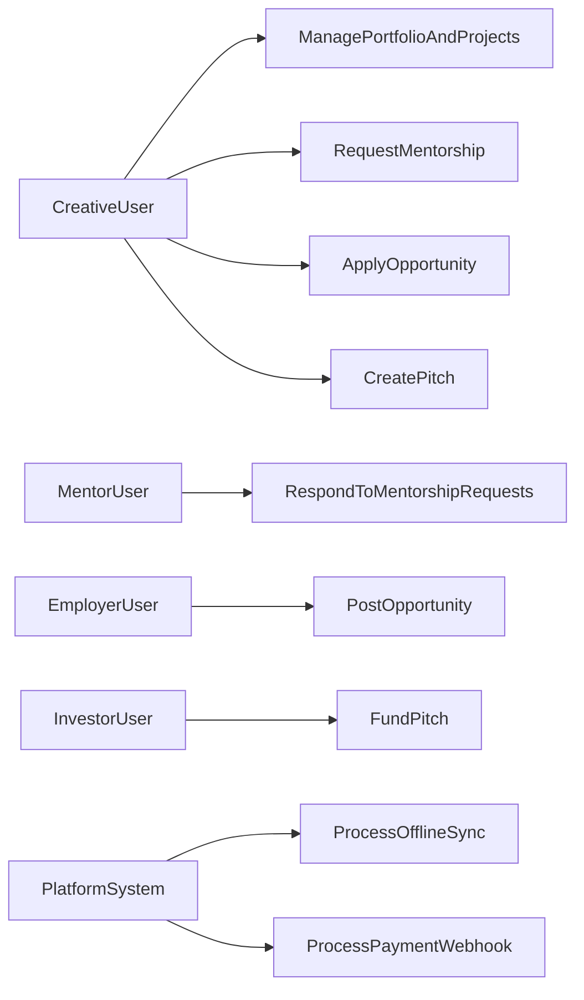
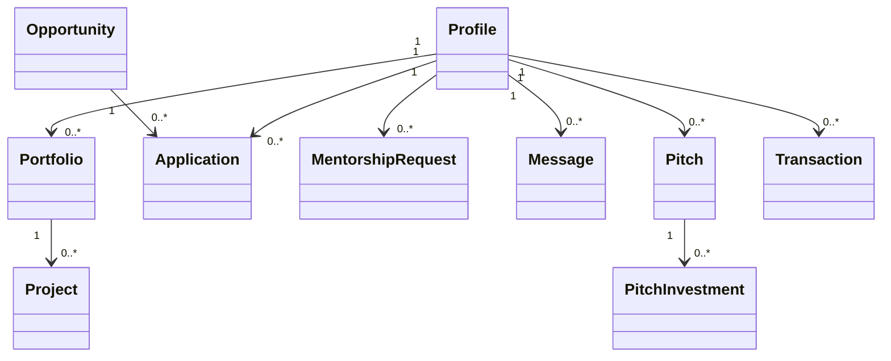
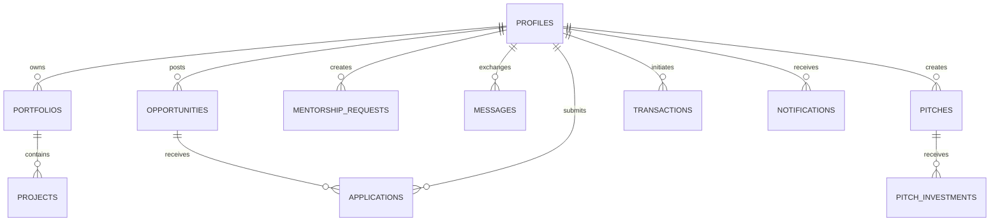
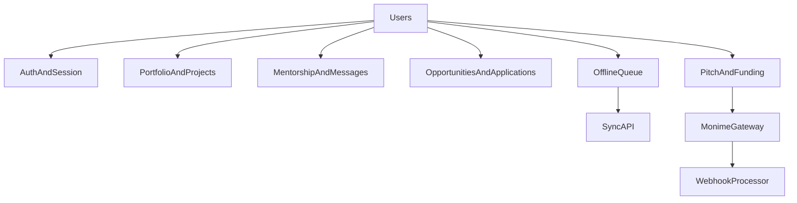
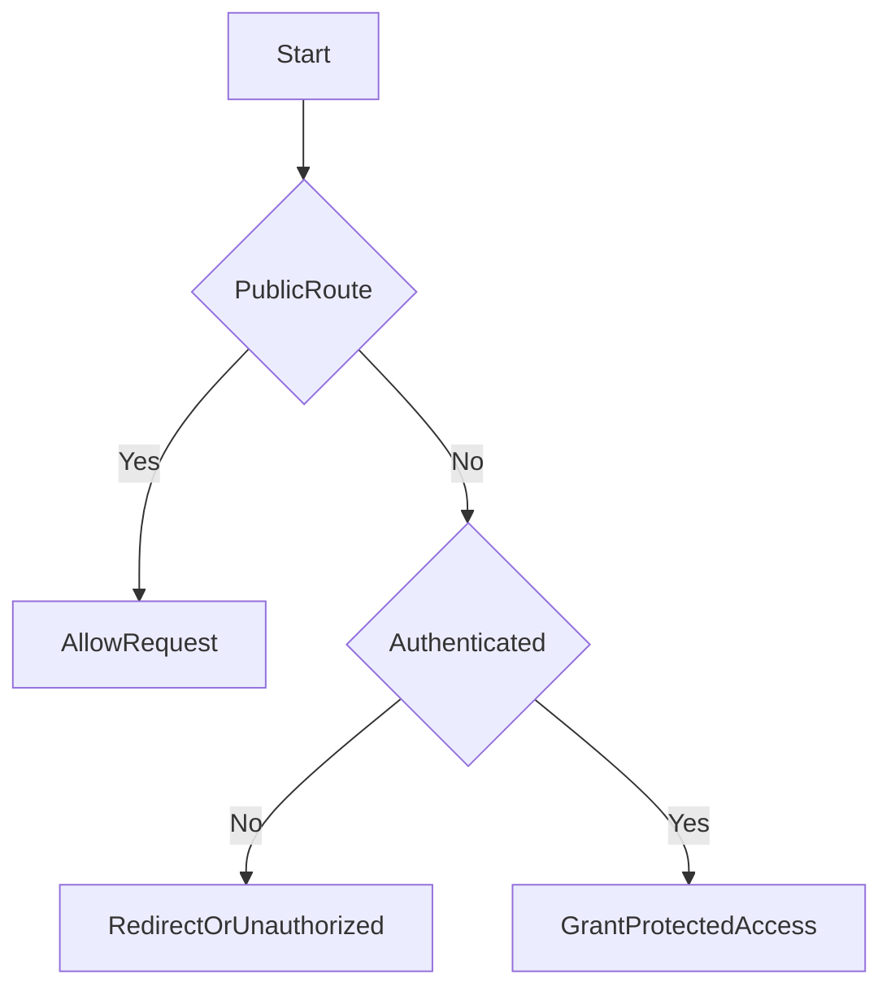
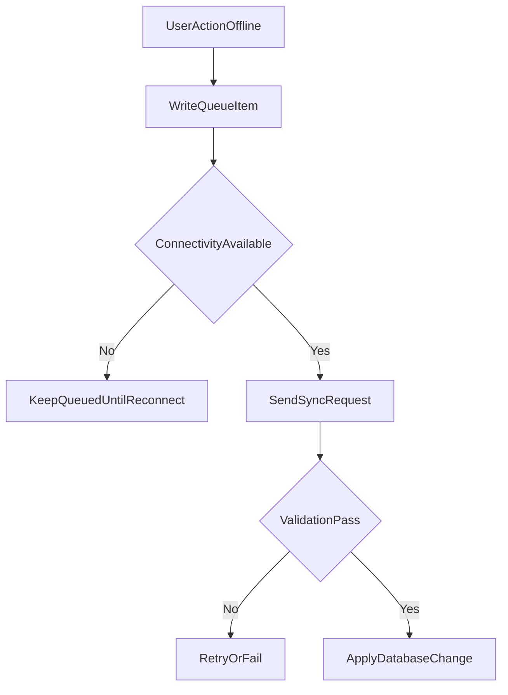
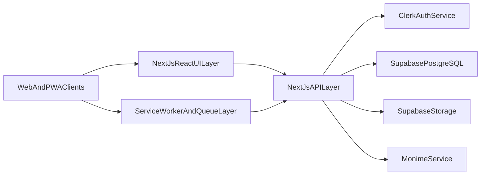

# CHAPTER FOUR: SYSTEM ANALYSIS AND DESIGN

## 4.1 Introduction

This chapter presents the system analysis and design of `Creatuno` in direct continuity with Chapter 1 (problem statement, aim/objectives, and scope) and Chapter 3 (methodological framework). It explains how identified ecosystem challenges in Sierra Leone's creative economy were translated into a practical, low-bandwidth-aware platform architecture and design.

The chapter addresses:

- existing-system analysis;
- key problem decomposition;
- proposed system and requirements;
- design models (use case, UML, ERD, DFD, flowcharts);
- architecture and infrastructure view.

---

## 4.2 Analysis of Existing System

Prior to `Creatuno`, creatives in the target context typically relied on fragmented processes:

- social media for portfolio exposure;
- informal messaging for mentorship and client communication;
- disconnected channels for jobs and gigs;
- manual payment coordination;
- always-online tools that degrade under intermittent connectivity.

### 4.2.1 Existing-System Characteristics

1. **Fragmented identity:** professional work and credibility signals were spread across multiple platforms.
2. **Weak mentorship structure:** mentor access and progression pathways were largely informal.
3. **Limited process traceability:** opportunity, application, and transaction lifecycles were hard to track.
4. **Connectivity exclusion:** tools designed for high-bandwidth usage constrained participation.
5. **Low contextual fit:** global platforms did not adequately reflect local workflow and access realities.

---

## 4.3 Problems of the Existing System

### 4.3.1 Mentorship and Professional Development Deficit

- no structured mentor discovery and matching path;
- limited continuity in mentor-mentee engagement;
- weak formal support for practical professional growth.

### 4.3.2 Visibility and Professional Discovery Deficit

- heavy dependence on algorithm-driven social feeds;
- lack of standardized portfolio format for credible professional presentation;
- weak sustained discoverability by employers, collaborators, and investors.

### 4.3.3 Connectivity and Data-Cost Constraint

- intermittent internet and high data costs reduce platform reliability;
- high-bandwidth interfaces become practically inaccessible for many users;
- upload/update operations often fail under unstable network conditions.

### 4.3.4 Employment and Monetization Constraint

- opportunities distributed across scattered channels;
- application workflows lacked clear lifecycle states;
- limited pathways connecting creatives to funding and investment.

### 4.3.5 Platform Fragmentation Constraint

- no unified environment for portfolio, mentorship, opportunities, and funding;
- high friction from multi-platform switching for one professional journey.

---

## 4.4 Proposed System

`Creatuno` is proposed as a mobile-first Progressive Web Application integrating the core professional workflows of creatives in one platform.

### 4.4.1 Proposed Capabilities

- structured digital portfolios and project showcasing;
- mentorship requests, offers, and communication support;
- opportunities listing and application workflows;
- pitch and investor-funding interactions;
- notifications and process-state visibility;
- offline queueing and deferred synchronization.

### 4.4.2 Scope Positioning (Aligned to Chapter 1.8)

- primary user focus: Sierra Leonean creatives, with strong emphasis on ages 18-35;
- operating context: low-bandwidth, mobile-dominant usage conditions;
- evaluation boundary: pilot-oriented implementation and testing.

---

## 4.5 System Requirements

### 4.5.1 Functional Requirements

The system shall:

1. authenticate users and protect restricted operations;
2. support portfolio and project creation, update, and public display;
3. support opportunities listing and applications;
4. support mentorship request/offer and communication flows;
5. support pitch, investor-interest, and payment-linked funding workflows;
6. support notifications for major workflow events;
7. support offline queueing and synchronization.

### 4.5.2 Non-Functional Requirements

- **Availability:** web access with installable PWA behavior.
- **Performance:** data-efficient behavior through caching and optimized delivery.
- **Reliability:** queue-and-sync continuity under unstable connectivity.
- **Security:** authenticated operations and validated callback/webhook processing.
- **Scalability:** domain-modular APIs and migration-driven schema growth.
- **Usability:** clear workflow segmentation for target user tasks.

### 4.5.3 Objective-to-Requirement Traceability Matrix

| Chapter 1 Objective | Requirement Translation | System Subsystem |
|---|---|---|
| Objective 1 | stakeholder needs mapped to domain workflows | feature-domain API + UI modules |
| Objective 2 | low-bandwidth resilient architecture | PWA layer, service worker, queue, sync API |
| Objective 3 | structured portfolio and discoverability | portfolios/public/projects modules |
| Objective 4 | mentorship framework | mentorship/messages/notifications modules |
| Objective 5 | employment and investment linkage | opportunities/applications + pitch/payment modules |

---

## 4.6 Hardware Requirements

### 4.6.1 Development Hardware

- 64-bit CPU;
- minimum 8 GB RAM;
- adequate storage for dependencies/build artifacts;
- reliable internet for package and cloud integration.

### 4.6.2 End-User Hardware

- smartphone or desktop with modern browser support;
- intermittent connectivity tolerated for selected operations via offline queueing;
- optional PWA installation support.

### 4.6.3 Hosting Runtime Requirements

- Node.js-compatible hosting runtime;
- managed database and object storage;
- external identity and payment service availability.

---

## 4.7 Software Requirements

- Next.js, React, TypeScript;
- Supabase SDK and SQL migrations;
- Clerk for authentication;
- Monime payment integration;
- `next-pwa`, service worker, IndexedDB queue utilities;
- lint and build toolchain support.

---

## 4.8 System Design

### 4.8.1 Use Case Diagram

### 4.8.2 UML Domain Model

### 4.8.3 ER Diagram

### 4.8.4 Data Flow Diagram

### 4.8.5 System Flowcharts

#### A. Authentication and Access Flow

#### B. Offline Synchronization Flow

---

## 4.9 System Architecture

### 4.9.1 Architectural Style

`Creatuno` uses a modular monolithic architecture:

- one codebase combining presentation and API layers;
- domain-separated feature modules (`portfolios`, `opportunities`, `mentorship`, `payments`, `sync`);
- shared integration services for auth, data, and payments;
- migration-controlled relational schema evolution.

### 4.9.2 High-Level Architecture Diagram

### 4.9.3 Infrastructure and Deployment View

- runtime: Node.js-compatible environment;
- data infrastructure: managed PostgreSQL and media object storage;
- identity infrastructure: external authentication provider;
- transaction infrastructure: third-party payment processing with webhook callbacks;
- client reliability infrastructure: caching and deferred synchronization pipeline.

### 4.9.4 Architecture Strengths and Current Constraints

**Strengths**

- robust low-bandwidth fit through offline-first behavior;
- integrated workflows reduce ecosystem fragmentation;
- modular domain boundaries support incremental scaling.

**Current constraints**

- automated test depth remains expandable;
- advanced observability and production hardening remain next-stage work;
- national-scale impact measurement remains outside pilot scope.

---

## 4.10 Chapter Summary

This chapter translated Chapter 1 problem definitions and Chapter 3 methodological intent into a coherent system analysis and design for `Creatuno`. It established requirements, traceability, design artifacts, architecture rationale, and infrastructure structure suitable for low-bandwidth contexts, forming the foundation for implementation/testing (Chapter 5) and final interpretation (Chapter 6).

